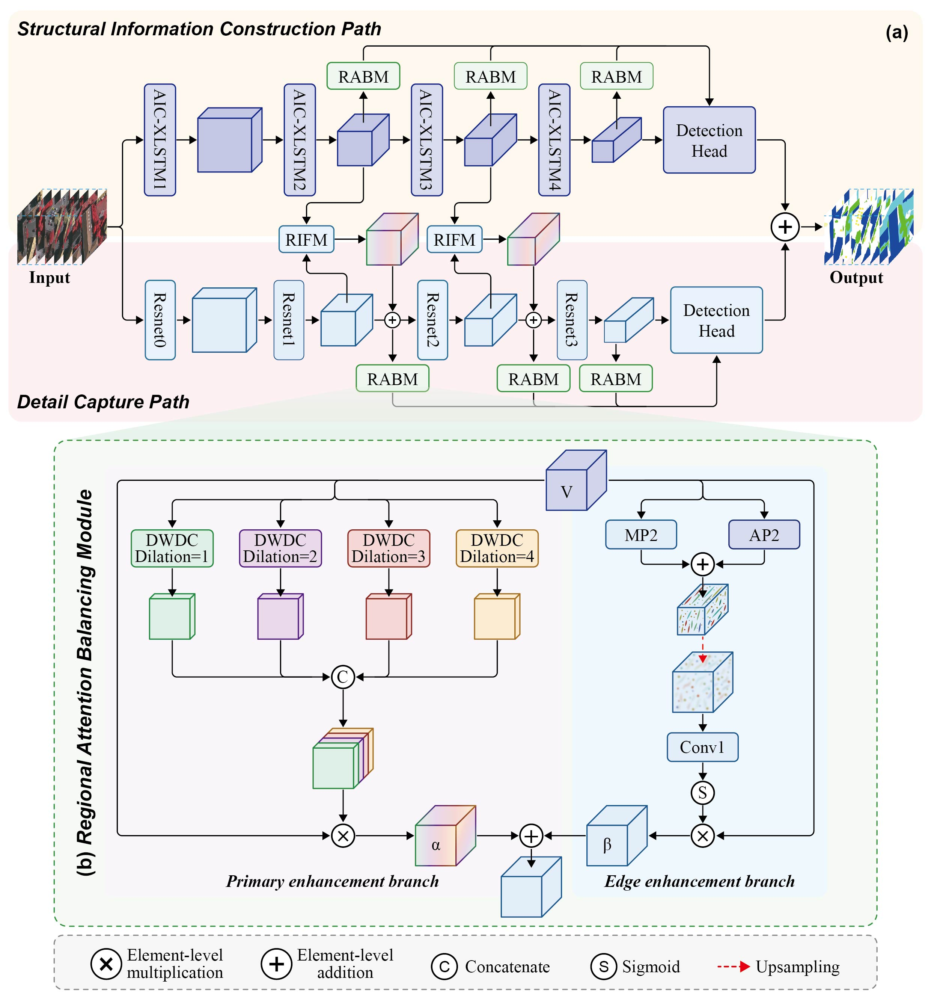

# MMDNet: A Lightweight Multilevel Multiscale Dual-Path Fusion Network for Remote Sensing Semantic Segmentation  

This repository provides the official implementation of the paper:  

**"A Lightweight Multilevel Multiscale Dual-Path Fusion Network for Remote Sensing Semantic Segmentation"**  
_Hong Ye, Jiaming Chang, Ke Wang, Zhaohong Jia, Wei Sun, Zhiwei Li_  
Accepted in **Pattern Recognition (PR), Elsevier, 2025**  
[DOI: 10.1016/j.patcog.2025.112483](https://doi.org/10.1016/j.patcog.2025.112483)  

---

## 🌟 Highlights
- **MMDNet** introduces a **dual-path architecture**:
  - **Detail Capture Path**: preserves fine-grained local features.  
  - **Structural Information Construction Path**: captures global structural information using an improved Vision-LSTM.  
- **AIC-XLSTM**: an enhanced Vision-LSTM with an Adaptive Information Compensation Module to amplify differences between similar categories while maintaining lightweight design.  
- **Reinforced Information Fusion Module (RIFM)**: filters noise and fuses multi-path features with a three-stage strategy.  
- **Regional Attention Balancing Module (RABM)**: improves boundary classification by distributing attention smoothly across objects and edges.  
- Achieves **state-of-the-art accuracy with minimal parameters** on four remote sensing datasets (Vaihingen, Potsdam, LoveDA, FloodNet).  

---

## 📊 Results (mIoU %)

| Dataset   | MMDNet (ours) | Parameters (MB) | Notable Improvement |
|-----------|---------------|-----------------|----------------------|
| Vaihingen | **76.28**     | **7.16**        | +0.24% over UNetFormer with 40% fewer params |
| Potsdam   | **82.70**     | **7.16**        | Outperforms heavier models (CMTFNet, MANet) |
| LoveDA    | **50.99**     | **7.16**        | Highest mIoU with only ~20% of competing model size |

---

## 🏗️ Architecture
MMDNet consists of three key modules:  
- **AIC-XLSTM** – captures long-range dependencies and enhances inter-class discrimination.  
- **RIFM** – noise-resistant fusion of dual-path features.  
- **RABM** – balances regional attention to refine object boundaries.  

  <!-- Replace with your figure path -->
  <!-- Replace with your figure path -->
  <!-- Replace with your figure path -->

